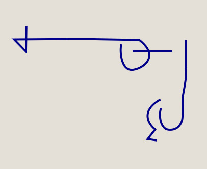
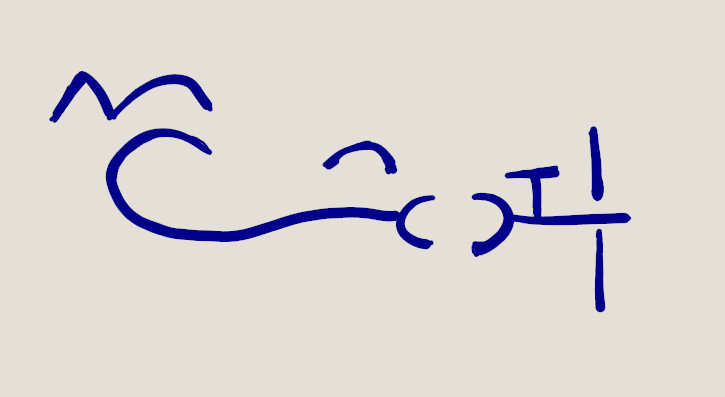

# Syntactic Parsing

Here I'm describing the general rules for Syntactic Parsing on the UNLWS tool. This rules may differ from the ones on the actual UNLWS.

There are 2 main elements in the Syntax: Glyphs, Glyphs Instance and Connections.

Glyph Instances are not Glyphs, but a representation of a Glyph. Glyphs are present in the Dictionary, when used in a sentence they are turned into Glyph Instances.

## Glyphs
- Weight
- Line: The visible line
- Binding points: All binding points are equal
- Slots: Similar to Binding Points, but every slot has a unique name

### Binding Points
Properties:
- Position: x, y
- Rotation: angle in radians

### Slots
Properties:
- Position: x, y
- Rotation: angle in radians
- Name

## Glyphs Instance
Inherits the properties from Glyphs, plus the following properties that are unique on each instance:
- UUID: A unique id, to distinguish one instance from others
- Position: x, y
- Rotation: angle in radians

## Connections
Have the following properties:
- Glyph A uuid: Glyph instance on one side of the connection
- Glyph B uuid: Glyph instance on one other side of the connection
- Type A: Slot, Binding Point, Inside of
- Type B: Slot, Binding Point, Inside of
- Position A: Top, Bottom, Right, Left (glyph B position relative to glyph A)
- Position B: Top, Bottom, Right, Left (glyph A position relative to glyph B)
- Slot A name: If connection A is Slot type, its Name
- Slot B name: If connection B is Slot type, its Name

## Rules
- At most 1 connection can exists between two glyph instances
- At most 1 glyph instance can connect to a Slot
- At most 1 glyph instance can connect to a Binding Point
- Identity glyph instance must be present explicitly

Connections don't have a direction, but to simplify the design, and prevent duplicated mirrored connections Glyphs have a property called "Weights", that indicates the desired direction of a connection.

# Examples

## There is a thing that is fish, and is large

### Glyphs instances
- Fish (weight: 0)
- Identity (weight: 5)
- Large (weight: 0)

### Connections

1

- Glyph A uuid: Fish
- Glyph B uuid: Identity
- Point A:
  - Type: Binding Point
  - Position: Top
  - Name: null
- Point B:
  - Type: Binding Point
  - Position: Left
  - Name: null

2

- Glyph A uuid: Large
- Glyph B uuid: Identity
- Point A:
  - Type: Binding Point
  - Position: Right
  - Name: null
- Point B:
  - Type: Binding Point
  - Position: Bottom
  - Name: null

## There is a thing that is me, and remembers a thing that is a cat

### Glyph instances
- Me (weight: 0)
- IdentityMe (weight: 5)
- Remember (weight: 10)
- Cat (weight: 0)
- IdentityCat (weight: 5)

### Connections

1

- Glyph A uuid: Me
- Glyph B uuid: IdentityMe
- Point A:
  - Type: Binding Point
  - Position: Right
  - Name: null
- Point B:
  - Type: Binding Point
  - Position: Left
  - Name: null

2

- Glyph A uuid: Cat
- Glyph B uuid: IdentityCat
- Point A:
  - Type: Binding Point
  - Position: Left
  - Name: null
- Point B:
  - Type: Binding Point
  - Position: Right
  - Name: null

3

- Glyph A uuid: Remember
- Glyph B uuid: IdentityMe
- Point A:
  - Type: Slot
  - Position: Right
  - Name: Agent
- Point B:
  - Type: Binding Point
  - Position: Right
  - Name: null

4

- Glyph A uuid: Remember
- Glyph B uuid: IdentityCat
- Point A:
  - Type: Slot
  - Position: Left
  - Name: Theme
- Point B:
  - Type: Binding Point
  - Position: Top
  - Name: null

## Are cats sentient?

### Glyph instances
- Cat (weight: 0)
- IdentityCat (weight: 5)
- GenericArticle (weight: 0)
- IsRelTrue (weight: 15)
- Think (weight: 10)
- Imperfective (weight: 0)

### Connections

1

- Glyph A uuid: Cat
- Glyph B uuid: IdentityCat
- Point A:
  - Type: Binding Point
  - Position: Left
  - Name: null
- Point B:
  - Type: Binding Point
  - Position: Right
  - Name: null

2

- Glyph A uuid: GenericArticle
- Glyph B uuid: IdentityCat
- Point A:
  - Type: Binding Point
  - Position: Bottom
  - Name: null
- Point B:
  - Type: Binding Point
  - Position: Top
  - Name: null

3

- Glyph A uuid: IdentityCat
- Glyph B uuid: IsRelTrue
- Point A:
  - Type: Slot
  - Position: Right
  - Name: null
- Point B:
  - Type: Slot
  - Position: Left
  - Name: SideA

4

- Glyph A uuid: Think
- Glyph B uuid: IsRelTrue
- Point A:
  - Type: Slot
  - Position: Bottom
  - Name: SideA
- Point B:
  - Type: Slot
  - Position: Right
  - Name: null
 
 5

- Glyph A uuid: Imperfective
- Glyph B uuid: Think
- Point A:
  - Type: Binding Point
  - Position: Bottom
  - Name: null
- Point B:
  - Type: Binding Point
  - Position: Right
  - Name: null