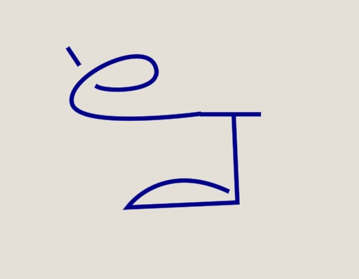

# Syntactic Parsing

Here I'm describing the general rules for Syntactic Parsing on the UNLWS tool. This rules may differ from the ones on the actual UNLWS.

There are 2 main elements in the Syntax: Glyphs, Glyphs Instance and Connections.

Glyph Instances are not Glyphs, but a representation of a Glyph. Glyphs are present in the Dictionary, when used in a sentence they are turned into Glyph Instances.

## Glyphs
- Weight
- Line: The visible line
- Binding points: All binding points are equal
- Slots: Similar to Binding Points, but every slot has a unique name

### Binding Points
Properties:
- Position: x, y
- Rotation: angle in radians

### Slots
Properties:
- Position: x, y
- Rotation: angle in radians
- Name

## Glyphs Instance
Inherits the properties from Glyphs, plus the following properties that are unique on each instance:
- UUID: A unique id, to distinguish one instance from others
- Position: x, y
- Rotation: angle in radians

## Connections
Have the following properties:
- Glyph A uuid: Glyph instance on one side of the connection
- Glyph B uuid: Glyph instance on one other side of the connection
- Type A: Slot, Binding Point, Inside of
- Type B: Slot, Binding Point, Inside of
- Position A: Top, Bottom, Right, Left (glyph B position relative to glyph A)
- Position B: Top, Bottom, Right, Left (glyph A position relative to glyph B)
- Slot A name: If connection A is Slot type, its Name
- Slot B name: If connection B is Slot type, its Name

## Rules
- At most 1 connection can exists between two glyph instances
- At most 1 glyph instance can connect to a Slot
- At most 1 glyph instance can connect to a Binding Point
- Identity glyph instance must be present explicitly

Connections don't have a direction, but to simplify the design, and prevent duplicated mirrored connections Glyphs have a property called "Weights", that indicates the desired direction of a connection.

# Examples

"There is a thing that is fish, and is large"

Glyphs instances
- Fish
- Identity
- Large

Connections

1

- Glyph A uuid: Fish
- Glyph B uuid: Identity
- Type A: Binding Point
- Type B: Binding point
- Position A: Top (Glyph Identity is at the Top side of Glyph Fish)
- Position B: Left (Glyph Fish is at the Left side of Glyph Identity)
- Slot A name: null
- Slot B name: null

2

- Glyph A uuid: Large
- Glyph B uuid: Identity
- Type A: Binding Point
- Type B: Binding point
- Position A: Right (Glyph Identity is at the Right side of Glyph Large)
- Position B: Bottom (Glyph Large is at the Bottom side of Glyph Identity)
- Slot A name: null
- Slot B name: null

"There is a thing that is me, and remembers a thing that is a cat"

Glyphs instances
- Me
- IdentityMe
- Remember
- Cat
- IdentityCat

Connections

2

- Glyph A uuid: Me
- Glyph B uuid: IdentityMe
- Type A: Binding Point
- Type B: Binding point
- Position A: Right (Glyph IdentityMe is at the Right side of Glyph Me)
- Position B: Left (Glyph Me is at the Left side of Glyph IdentityMe)
- Slot A name: null
- Slot B name: null

3

- Glyph A uuid: Cat
- Glyph B uuid: IdentityCat
- Type A: Binding Point
- Type B: Binding point
- Position A: Left (Glyph IdentityCat is at the Left side of Glyph Cat)
- Position B: Right (Glyph Cat is at the Right side of Glyph IdentityCat)
- Slot A name: null
- Slot B name: null

4

- Glyph A uuid: Remember
- Glyph B uuid: IdentityMe
- Type A: Slot
- Type B: Binding point
- Position A: Right (Glyph IdentityMe is at the Right side of Glyph Remember)
- Position B: Right (Glyph Remember is at the Right side of Glyph IdentityMe)
- Slot A name: Agent
- Slot B name: null

5

- Glyph A uuid: Remember
- Glyph B uuid: IdentityCat
- Type A: Slot
- Type B: Binding point
- Position A: Left (Glyph IdentityCat is at the Left side of Glyph Remember)
- Position B: Top (Glyph Remember is at the Top side of Glyph IdentityCat)
- Slot A name: Theme
- Slot B name: null